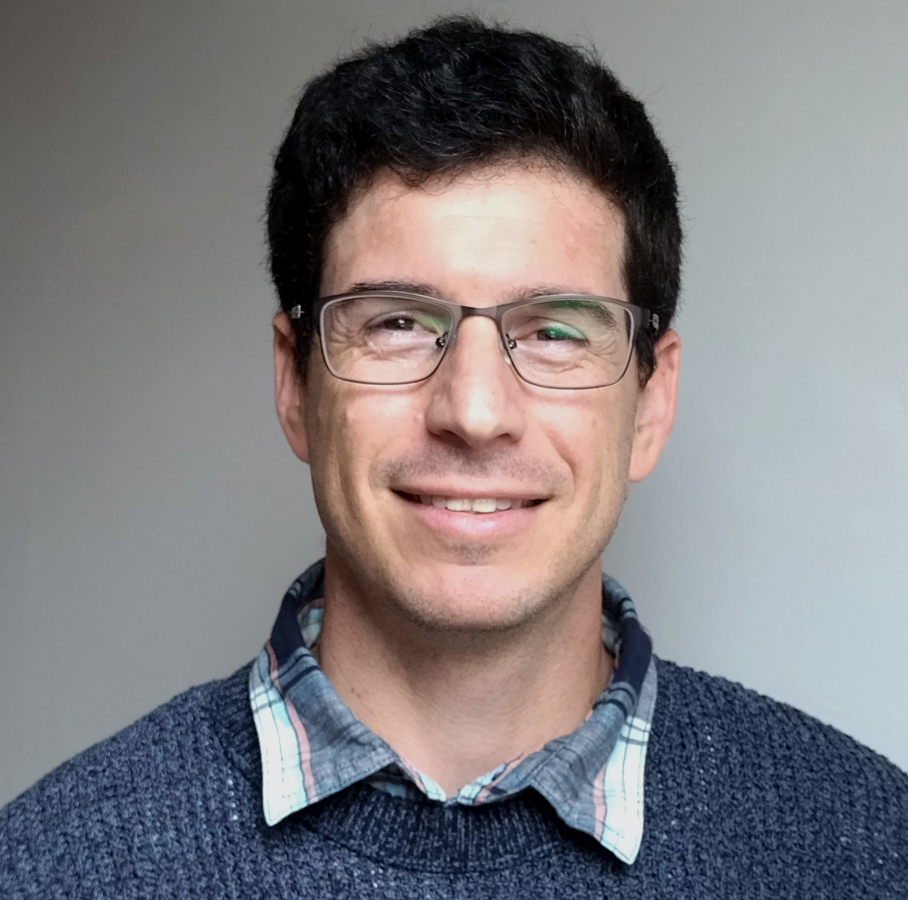

> All the brilliant minds working together  
  on the same thing,  
  at the same time,  
  in the same space,  
  and at the same computer.  
  ~Woody Zuill

Ensemble Programming is a modern progression to the XP practices. It is a whole-team approach to software development. 

## Ensemble Programming Workshop

Experience firsthand a hands-on workshop focused on collaborative coding, where participants work as a team on a single thing. Feel the unstoppable momentum and strength derived from group knowledge, leading to increased productivity, enhanced quality, and an amplified learning experience for everyone involved.  
This format works well in a 120 minutes timeframe. 

## Audience

We welcome everyone, from seasoned developers in any stack to those without any development experience.
The workshop works well for audiences of any size larger than three. 
Recently we did it with groups of nine, 35 and even 80 people with very positive feedback.

## Why join?

- Learn to work effectively as a team.
- Get into the flow of getting things done.
- Have fun solving a problem together leveraging people's diverse skills.
- Discover how Ensemble Programming amplifies learning.
- Practice clear communication.
- Although the workshop is in person, Ensemble Programming is a great way for teams to collaborate remotely, too.

## What to expect?

- See a demo of experienced Ensemble Programmers
- Guided hands-on practice in an Ensemble
- Fun
- Time to reflect
- Get inspired

## Agenda

### Part 1: Guided Ensemble

- Introduction (5 minutes)
- Live Ensemble with Whole Audience (15 minutes)
- Mid-session Discussion (10 minutes)
- Live Ensemble with Whole Audience - Continued (25 minutes)
- Retro (5 minutes)

### Part 2: Ensemble Sessions in Small Groups

- Work (40 minutes)
- Retro in Each Group (5 minutes)
- Groups share their experience (10 min)
- Conclusion and Q&A (5 minutes)

## About Us

### Nitsan Avni 

Ever since trying Ensemble Programming, Nitsan has become a proponent of it. A Software Developer and Samman Technical Coach at Gigablue, most of all he likes to learn new things - currently it's the unicycle. ChatGPT addict.
 
 
 
 
 
 
 

### Gregor Riegler 

Gregor's passion for learning and making things better has led him to develop a particular interest in Ensemble Programming. He is an active member of the Samman Technical Coaching Society and serves as a Technical Coach and Principal Software Engineer at Tricentis.

[gregorriegler.com](https://gregorriegler.com/)

 
 
 
 

## References
Nitsan and Gregor have extensive experience not only working in Ensembles but also in facilitating and delivering Ensemble Programming Workshops.

- [Ensemble Programming Workshop at PyConDE 2023](https://www.youtube.com/watch?v=T_sx05-W4Lw)
- [Hands-On Remote Ensemble Programming Facilitation on the Global Day of **Continuous** Coderetreat 2022](https://coderlevelup.org/globaldayofcoderetreat2022-48hr)
- [Introduce Ensemble Workshop by Emily Bache and Nitsan Avni - Testimonial](https://www.linkedin.com/feed/update/urn:li:activity:7140466077238538242/)
- [Facilitation of a Mob Programming Session on the GDCR 2023 in Vienna, Austria](https://gregorriegler.com/speaking)
- and more ...
